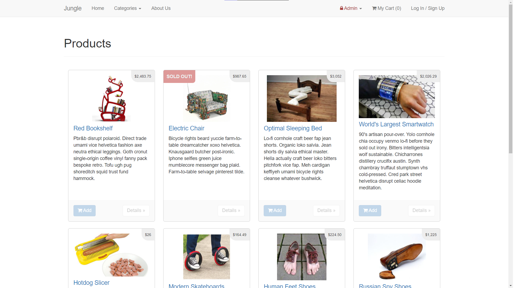
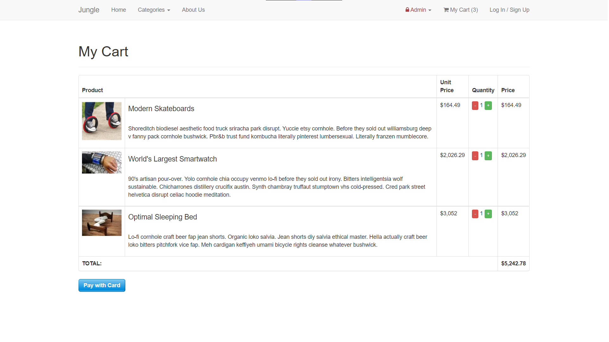
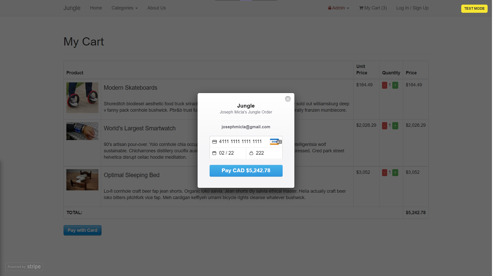
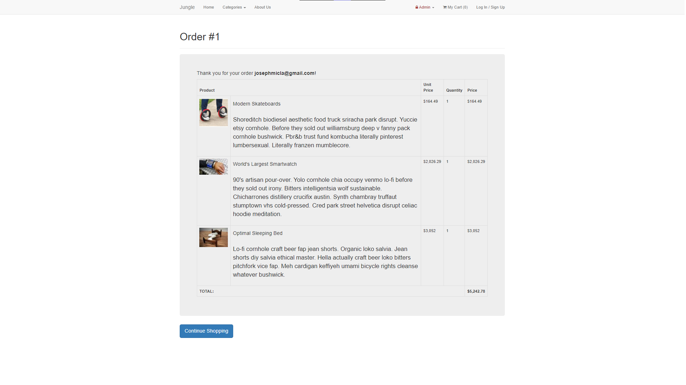

# Jungle

## Table Of Contents
- [Summary](#summary)
- [About](#about)
- [Features](#features)
  - [Admins](#admins)
  - [Users](#users)
- [Screenshots](#screenshots)
- [Setup](#setup)
  - [Apple M1 setup](#apple-m1-setup)
  - [Project Setup](#project-setup)
  - [Stripe](#stripe-testing)
  - [Dependencies](#dependencies)

## Summary

A mini e-commerce application built with Rails 4.2 for purposes of teaching Ruby on Rails by example.

## About

Jungle simulates the inheritance of an older project. Developers are not always able to use the latest and greatest tools, since it would break applications, or make them unreliable. This poject emphasizes the need for strong problem solving skills. 

The tasks for this project involved adding in new features such as user authentication, category creation, a "sold out" badge, an order detail page, an admin dashboard, and multiple bug fixes from the original repository. Tests were also added to these new features, as well as existing ones.

## Features
- ### Admins:
  - Create Products with titles, images, descriptions, price etc.
  - Delete Products
  - Create categories for products
- ### Users:
  - Purchase products if in stock
  - Add items to a cart
  - Make transactions using Stripe
  - Able to view past order details
  - View a list of all current products
  - Create or log into an account

## Screenshots

## Setup

### Apple M1 Setup

1. Make sure that you are runnning Ruby 2.6.6 (`ruby -v`)
1. Install ImageMagick `brew install imagemagick imagemagick@6 --build-from-source`
2. Remove Gemfile.lock
3. Replace Gemfile with version provided [here](https://gist.githubusercontent.com/FrancisBourgouin/831795ae12c4704687a0c2496d91a727/raw/ce8e2104f725f43e56650d404169c7b11c33a5c5/Gemfile)

### Project Setup

1. Run `bundle install` to install dependencies
2. Create `config/database.yml` by copying `config/database.example.yml`
3. Create `config/secrets.yml` by copying `config/secrets.example.yml`
4. Run `bin/rake db:reset` to create, load and seed db
5. Create .env file based on .env.example
6. Sign up for a Stripe account
7. Put Stripe (test) keys into appropriate .env vars
8. Run `bin/rails s -b 0.0.0.0` to start the server

### Stripe Testing

Use Credit Card # 4111 1111 1111 1111 for testing success scenarios.

More information in their docs: <https://stripe.com/docs/testing#cards>

### Dependencies

* Rails 4.2 [Rails Guide](http://guides.rubyonrails.org/v4.2/)
* PostgreSQL 9.x
* Stripe
